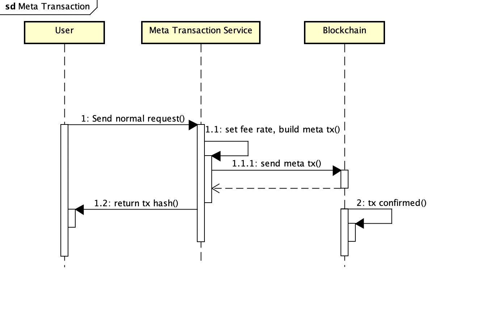

# Meta transaction
A meta-transaction is essentially an operation that fulfils a fee payment in proxy. `Address1` gives the transaction to be sent to `Address2`. And `Address2` signs the information related to the fee deduction and places it in the `data` data segment of the transaction. The transaction is then broadcast and the blockchain processes the transaction according to the rules.



# Java Demo 

https://github.com/bitindi-labs/metatx-Java-demo

## Build meta transaction
- Obtain the original `rawTransaction` information.
- Parse raw transaction to get fields like `nonce`, `gasprice`, `gaslimit`, `from address`, `to address`, `value`, `data`, etc.
- Take the above fields, as well as the fee discount percentage and other fields, and encode them in RLP format as follows for example.
```Java
    List<RlpType> result = new ArrayList();
    result.add(RlpString.create(nonce));
    result.add(RlpString.create(gasPrice));
    result.add(RlpString.create(gasLimit));
    result.add(RlpString.create(receiveAddress));

    result.add(RlpString.create(value));
    result.add(RlpString.create(data));
    result.add(RlpString.create(sendAddress));
    result.add(RlpString.create(feePercent));
    result.add(RlpString.create(blockNumber));
    result.add(RlpString.create(chainId));

    RlpList rlpList = new RlpList(result);
    this.rlpEncodeData = RlpEncoder.encode(rlpList);
```
- Sign the above data by the fee proxy address.
- Replace the `data` filed in the original transaction with the signed data and re-encode it as `rawTransaction`.
- Broadcast `rawTransaction` to blockchain；
